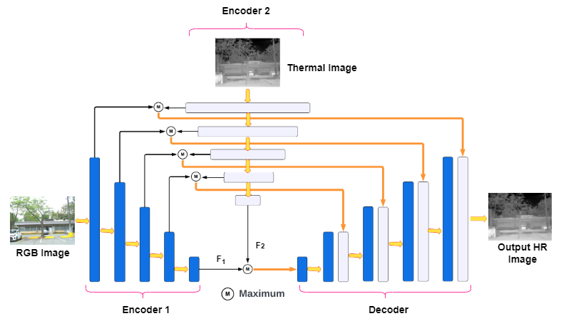

# CoReFusion
Pytorch code for our paper
### Contrastive Regularized Fusion for Guided Thermal Super-Resolution
<div align="center">
  
</div>
 Thermal imaging has numerous advantages over regular visible-range imaging since it performs well in low-light
circumstances. Super-Resolution approaches can broaden
their usefulness by replicating accurate high-resolution
thermal pictures using measurements from low-cost, lowresolution thermal sensors. Because of the spectral range
mismatch between the images, Guided Super-Resolution of
thermal images utilizing visible range images is difficult.
However, In case of failure to capture Visible Range Images
can prevent the operations of applications in critical areas. We present a novel data fusion framework and regularization technique for Guided Super Resolution of Thermal
images. The proposed architecture is computationally inexpensive and lightweight with the ability to maintain performance despite missing one of the modalities, i.e., highresolution RGB image or the lower-resolution thermal image, and is designed to be robust in the presence of missing
data. The proposed method presents a promising solution to
the frequently occurring problem of missing modalities in a
real-world scenario.
<div align="center">
  
</div>

## Get Started
```
$ git clone https://github.com/Kasliwal17/ThermalSuperResolution.git
$ cd ThermalSuperResolution
```
## Dependencies 
- Pytorch 1.11.0
- Segmentation-models-pytorch
- wandb
## Train & Eval
```
$ python -m src.train
```
